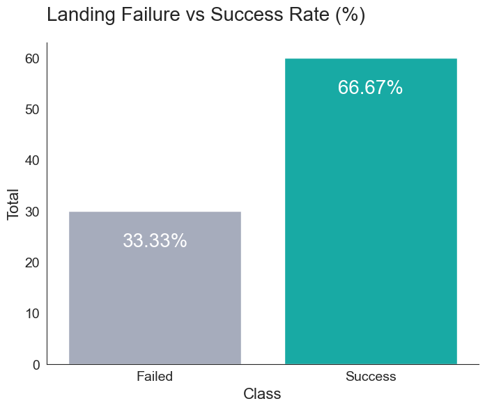
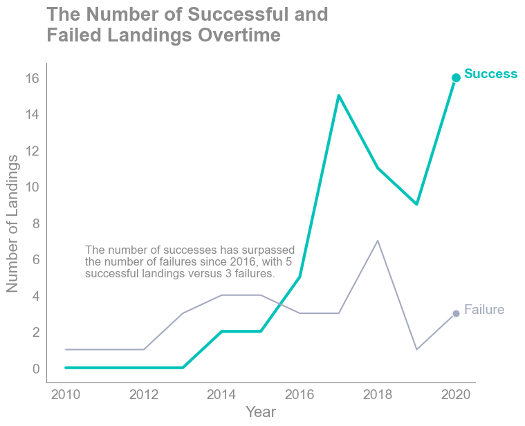

# Applied Data Science Capstone Report

### Table of Contents

1. Executive Summary
2. Introduction
3. Methodology
4. Findings and Results
    1. Exploratory Data Analysis
   2. Dashboard
   3. Machine Learning Results
5. Discussion
6. Conclusion
7. Appendix & References

## 1. Executive Summary
SpaceY, an emerging rocket launch company, founded by billionaire industrialist Allon Musk, is positioning itself to compete with industry giant SpaceX. This project's core objective is two-fold: firstly, to ascertain the optimal launch pricing strategy, and secondly, to forecast the likelihood of SpaceX reusing its initial launch stage based on historical data gleaned from past SpaceX rocket launches.

Our analysis draws from a dataset encompassing 90 SpaceX project launches, each characterized by 18 pertinent features such as Booster Landing, Version Booster, Customer, Orbit, Payload Mass, and more. Among these, three pivotal features merit particular attention: "Flight Number," denoting launch sequence; "Launch Site," indicating the rocket's liftoff location; and "Orbit," signifying the targeted orbital destination. The dataset, sourced from the SpaceX API and web, underwent meticulous cleansing, including filtration to exclusively incorporate Falcon 9 data. Although a segment of the Landing Pad data exhibited a 28.89% deficiency, this omission remained inconsequential for our analytical pursuit.

Our exploratory data analysis employed an array of visualization techniques and SQL commands, expounding the data's essence. Scatter plots and bar charts facilitated comprehension of the distribution of classes—0 indicating unsuccessful landings and 1 symbolizing successful landing. Notably, 66.67% of launches achieved triumphant landings. Remarkably divergent success rates emerged across different launch sites. Particularly for the CCAFS SLC 40 launch site, an escalation in successful landings paralleled mounting flight volumes, signifying an analogous trend for all launch sites. A discernible decline in failed landings further underscored this pattern. Prior to modeling endeavors, data underwent standardization and partitioning into training and testing subsets. 
Employing a quartet of models—logistic regression, support vector machine, decision tree, and k-nearest neighbor—we explored a spectrum of prediction accuracies. Leveraging GridSearchCV for optimal hyperparameter selection, we conducted 10-fold cross-validation across all models. Remarkably, all models exhibited identical accuracy at 0.83, coupled with an f1-score of 0.89 when tested on the testing dataset. This uniformity in high-performance outcomes empowers the selection of any of the models for effective predictions regarding landing project success. Notably, the decision tree model garners distinction, with the best accuracy achieved through hyperparameter tuning.

## 2. Introduction
A space rocket is composed of two primary stages: the first and the second stage. The initial stage holds exceptional significance as it performs most of the work and boasts a much larger size compared to the second stage. Not only is it larger, but it is also considerably more expensive. SpaceX has achieved the remarkable feat of recovering and reusing the first stage, enabling them to conduct missions such as sending spacecraft to the international space station and facilitating manned space missions. This innovative approach significantly reduces project launch costs, which can amount to $62 million per launch. Determining the success of the first stage landing becomes pivotal in accurately estimating launch expenses. This crucial information empowers the company in making well-informed decisions. Playing a pivotal role in this process are Machine Learning algorithms, utilized for predicting the outcome of each launch and thereby guiding the company's decision-making process.

## 3. Methodology
Our exploratory data analysis encompassed a range of methodologies, including data cleaning, data visualization, statistical analysis, and the utilization of machine learning algorithms. The dataset was obtained from the SpaceX API and web scraping techniques. Subsequently, a rigorous data cleaning process was executed to retain only the requisite features essential for model construction. Initially comprising 43 columns from the API, the dataset was streamlined to a concise 18 columns. Retrieving the data was achieved using Python's GET requests library. For web scraping, a combination of GET requests and BeautifulSoup were employed to effectively access and collect the required data.
In the pursuit of visualizing our insights, we harnessed an array of visualization libraries such as Matplotlib, Seaborn, Folium, and Plotly. To elevate the interactivity of our visual representations and catalyze further explorations, we crafted an interactive dashboard utilizing the Dash App framework.
Diving into the realm of machine learning, we deployed diverse algorithms, including Logistic Regression, Support Vector Machine, Decision Tree Classifier, and K-Nearest Neighbors, for our predictive models. Before feeding the data into various models, we had to preprocess it by standardizing the feature data. Next, we divided the data into training and testing sets, with a test size of 0.2, which corresponds to 20% of our data being reserved for testing.
For all these models, we utilized the GridSearchCV object to identify the best hyperparameters. Subsequently, we calculated accuracy scores, generated confusion matrices, and produced classification reports (comprising of precision, recall, F1-score, accuracy, and more) to showcase our results. 

## 4. Results and Findings
### 4.i Exploratory Data Analysis
* The landing success rate that SpaceX has experienced, amounting to 66.67%, is twice that of its failures (33.33%). This discrepancy could potentially pose challenges for our model construction due to the unbalanced nature of the data. Consequently, additional measures need to be implemented to enhance the quality of the dataset.

* We observed that as the years have progressed, the number of successes has increased and surpassed the number of failures since 2016, which was larger initially. This may be attributed to the experience and lessons learned from previous launch projects.

### 4.ii Dashboard

### 4.iii Machine Learning Results

## 5. Discussion

## 6. Conclusion

## 7. Appendix & References

