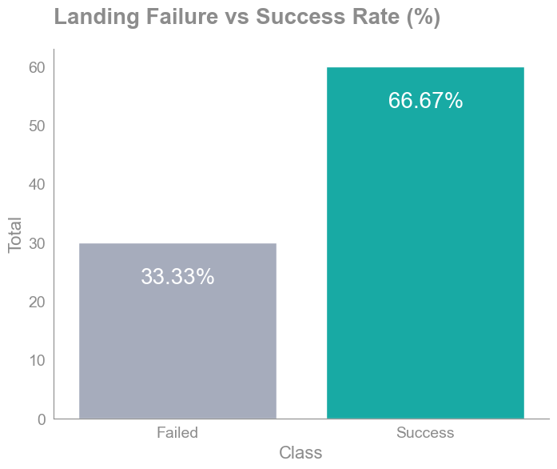

# Applied Data Science Capstone Report

### Table of Contents

1. Executive Summary
2. Introduction
3. Methodology
4. Findings and Results
    1. Exploratory Data Analysis
   2. Dashboard
   3. Machine Learning Results
5. Discussion
6. Conclusion
7. Appendix & References

## 1. Executive Summary
SpaceY, an emerging rocket launch company, founded by billionaire industrialist Allon Musk, is positioning itself to compete with industry giant SpaceX. This project's core objective is two-fold: firstly, to ascertain the optimal launch pricing strategy, and secondly, to forecast the likelihood of SpaceX reusing its initial launch stage based on historical data gleaned from past SpaceX rocket launches.

Our analysis draws from a dataset encompassing 90 SpaceX project launches, each characterized by 18 pertinent features such as Booster Landing, Version Booster, Customer, Orbit, Payload Mass, and more. Among these, three pivotal features merit particular attention: "Flight Number," denoting launch sequence; "Launch Site," indicating the rocket's liftoff location; and "Orbit," signifying the targeted orbital destination. The dataset, sourced from the SpaceX API and web, underwent meticulous cleansing, including filtration to exclusively incorporate Falcon 9 data. Although a segment of the Landing Pad data exhibited a 28.89% deficiency, this omission remained inconsequential for our analytical pursuit.

Our exploratory data analysis employed an array of visualization techniques and SQL commands, expounding the data's essence. Scatter plots and bar charts facilitated comprehension of the distribution of classes—0 indicating unsuccessful landings and 1 symbolizing successful landing. Notably, 66.67% of launches achieved triumphant landings. Remarkably divergent success rates emerged across different launch sites. Particularly for the CCAFS SLC 40 launch site, an escalation in successful landings paralleled mounting flight volumes, signifying an analogous trend for all launch sites. A discernible decline in failed landings further underscored this pattern. Prior to modeling endeavors, data underwent standardization and partitioning into training and testing subsets. 
Employing a quartet of models—logistic regression, support vector machine, decision tree, and k-nearest neighbor—we explored a spectrum of prediction accuracies. Leveraging GridSearchCV for optimal hyperparameter selection, we conducted 10-fold cross-validation across all models. Remarkably, all models exhibited identical accuracy at 0.83, coupled with an f1-score of 0.89 when tested on the testing dataset. This uniformity in high-performance outcomes empowers the selection of any of the models for effective predictions regarding landing project success. Notably, the decision tree model garners distinction, with the best accuracy achieved through hyperparameter tuning.

## 2. Introduction
A space rocket is composed of two primary stages: the first and the second stage. The initial stage holds exceptional significance as it performs most of the work and boasts a much larger size compared to the second stage. Not only is it larger, but it is also considerably more expensive. SpaceX has achieved the remarkable feat of recovering and reusing the first stage, enabling them to conduct missions such as sending spacecraft to the international space station and facilitating manned space missions. This innovative approach significantly reduces project launch costs, which can amount to $62 million per launch. Determining the success of the first stage landing becomes pivotal in accurately estimating launch expenses. This crucial information empowers the company in making well-informed decisions. Playing a pivotal role in this process are Machine Learning algorithms, utilized for predicting the outcome of each launch and thereby guiding the company's decision-making process.

## 3. Methodology
Our exploratory data analysis encompassed a range of methodologies, including data cleaning, data visualization, statistical analysis, and the utilization of machine learning algorithms. The dataset was obtained from the SpaceX API and web scraping techniques. Subsequently, a rigorous data cleaning process was executed to retain only the requisite features essential for model construction. Initially comprising 43 columns from the API, the dataset was streamlined to a concise 18 columns. Retrieving the data was achieved using Python's GET requests library. For web scraping, a combination of GET requests and BeautifulSoup were employed to effectively access and collect the required data.
In the pursuit of visualizing our insights, we harnessed an array of visualization libraries such as Matplotlib, Seaborn, Folium, and Plotly. To elevate the interactivity of our visual representations and catalyze further explorations, we crafted an interactive dashboard utilizing the Dash App framework.
Diving into the realm of machine learning, we deployed diverse algorithms, including Logistic Regression, Support Vector Machine, Decision Tree Classifier, and K-Nearest Neighbors, for our predictive models. Before feeding the data into various models, we had to preprocess it by standardizing the feature data. Next, we divided the data into training and testing sets, with a test size of 0.2, which corresponds to 20% of our data being reserved for testing.
For all these models, we utilized the GridSearchCV object to identify the best hyperparameters. Subsequently, we calculated accuracy scores, generated confusion matrices, and produced classification reports (comprising of precision, recall, F1-score, accuracy, and more) to showcase our results. 

## 4. Results and Findings
### 4.i Exploratory Data Analysis
* The landing success rate that SpaceX has experienced, amounting to 66.67%, is twice that of its failures (33.33%). This discrepancy could potentially pose challenges for our model construction due to the unbalanced nature of the data. Consequently, additional measures need to be implemented to enhance the quality of the dataset.

* We observed that as the years have progressed, the number of successes has increased and surpassed the number of failures since 2016, which was larger initially. This may be attributed to the experience and lessons learned from previous launch projects.

* We also observe that various launch sites have varying success rates. CCAFS SLC-40 has a success rate of 60%, while KSC LC-39A and WAFB SLC 4E have success rates of 77%.

* As the number of flights at the CCAFS SLC-40 launch site increases, we notice a decreasing number of failed landings. This trend holds true for the other launch sites as well, where we can observe a consistent reduction in the number of failed landings.

* There isn't much difference in payload mass for the CCAFS SLC-40 launch site. However, we observe that three of the launches with the highest payload were successful.
* We also observed that there have been no rockets launched with heavy payload masses greater than 10,000 at the VAFB-SLC launch site.

* We observed that most low Earth orbits, such as ISS, VLEO, PO, LEO, and SSO, tended to experience a significant number of successes. However, it's worth noting that most of the company missions were focused on low Earth orbits. In contrast, GTO, a high Earth orbit, had more space missions than GEO. Nevertheless, GTO only achieved a 51.85% landing success rate (see Figure: Landing success rate).

* You should observe that success in the LEO orbit appears to be related to the number of flights, while in the GTO orbit, there seems to be no apparent relationship between the number of flights and success.

### 4.ii Dashboard

* The payload range with the highest number of successful launches falls between 0 and 10,000 kg, totaling 24 missions. The range with the highest success rate lies between 3,000 and 4,000 kg, boasting a success rate of 72.73% with a total of 8 successful launches and only 3 failed ones.
* The payload ranges with the lowest number of successful launches are (6,000 - 7,000), (6,000 - 8,000), and (6,000 - 9,000), all of which have 0 successes and 4 failures, resulting in a 0% success rate for each.
* The Booster Version Category with the highest success rate is B5, achieving a perfect 100% success rate. However, it's important to note that this category was only used in one mission. Consequently, we excluded it from consideration and focused on the remaining categories. As a result, the highest Booster Version Category with the highest success rate is FT, boasting a 66.67% success rate.

* KSC LC-39A has the highest number of successful launches, accounting for 41.2% of the total successful missions launched at this site, where the first stage successfully landed.

* KSC LC-39A was also- the site with the highest launch success rate of 76.9% versus 23.1% of failed launches.

### 4.iii Machine Learning Results

* Each of the four models exhibited distinct best scores during the tuning process. Surprisingly, they all achieved identical accuracy scores on the test set, which amounted to 0.83. Furthermore, the precision, recall, and F1-score were consistently high at 0.80 (80%), 1.00 (100%), and 0.89 (89%), respectively. These results are indicative of strong performance. Consequently, we recommend any of these models as a suitable choice.
* These models demonstrated exceptional accuracy in predicting the successful landing of the first stage, achieving 12 correct predictions out of 12, resulting in a perfect recall rate of 100% (1.00). However, the models encountered challenges when predicting unsuccessful landings. Of the predictions made in this regard, three were correct, while three were incorrect, signifying instances where the model predicted an unsuccessful landing, but the first stage landed successfully. This presents a concerning situation for the company, as these incorrect predictions translate into a loss of 64 million dollars, contrary to their anticipated savings.

## 5. Discussion

All the models utilized in our projects have the potential for further improvement. Here are some suggested enhancements for these models:
1.	**Reducing False Positives (FP)**: In our specific scenario, it is crucial to minimize the occurrence of False Positives, where the model predicts a successful rocket landing that doesn't happen. Such predictions incur unexpected expenses for the company. Conversely, False Negatives (FN), where the model predicts a failed landing that succeeds, are less critical. In these cases, the company benefits by saving money that they would otherwise lose.
2.	**Increasing Data Size**: To enhance the model's performance, one should consider augmenting the dataset by collecting more data points. It is essential to balance the distribution of outcomes in the data, as our current dataset appears to be imbalanced, with a 66.67% success rate and a 33.33% failure rate. Balancing the data can help prevent bias and improve the model's ability to generalize effectively.

## 6. Conclusion

In conclusion, our analysis of SpaceX's rocket launch data has provided valuable insights into the factors influencing the success of the first stage landing. SpaceY, the emerging rocket launch company, can benefit greatly from these findings in its quest to compete with industry leader SpaceX.
Our analysis revealed that the success rate of first stage landings by SpaceX stands at an impressive 66.67%, showcasing the effectiveness of their reusable rocket technology. This success rate has shown a positive trend over the years, indicating that SpaceX has learned from past missions and improved their processes.
Furthermore, our exploration of different launch sites highlighted variations in success rates, with KSC LC-39A leading the way with a 76.9% success rate. These insights can help SpaceY make informed decisions about launch site selection.
The machine learning models we employed demonstrated strong predictive capabilities, achieving an accuracy score of 0.83 and an F1-score of 0.89. While these results are promising, we must address the issue of false positives, as incorrect predictions of successful landings can lead to significant financial losses.
To further enhance our models, we recommend reducing false positives and increasing the size of the dataset to balance the distribution of outcomes. These improvements will not only strengthen the predictive capabilities of our models but also provide SpaceY with more reliable forecasts for first stage landings.
In summary, SpaceY is well-positioned to compete in the rocket launch industry, armed with data-driven insights and robust machine learning models. As they continue to refine their strategies and technology, SpaceY has the potential to make a significant impact in the space exploration sector, ultimately driving down launch costs and advancing our reach into the cosmos.

